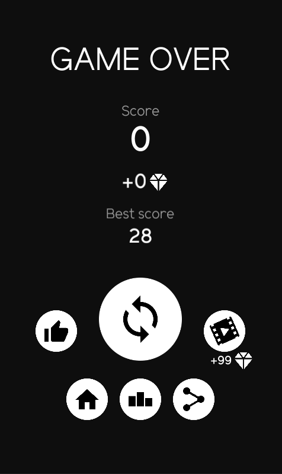
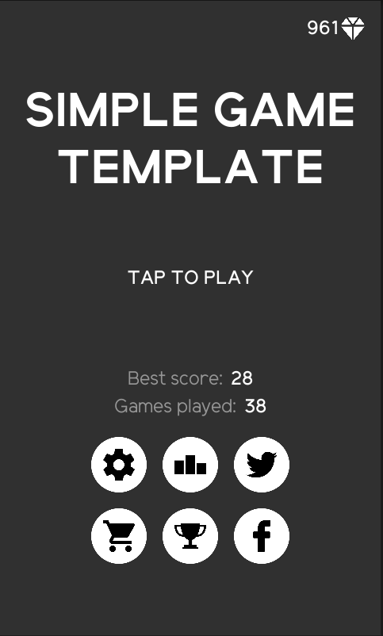
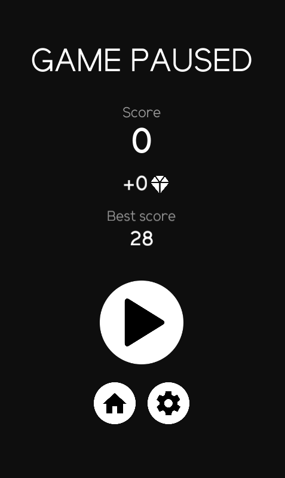
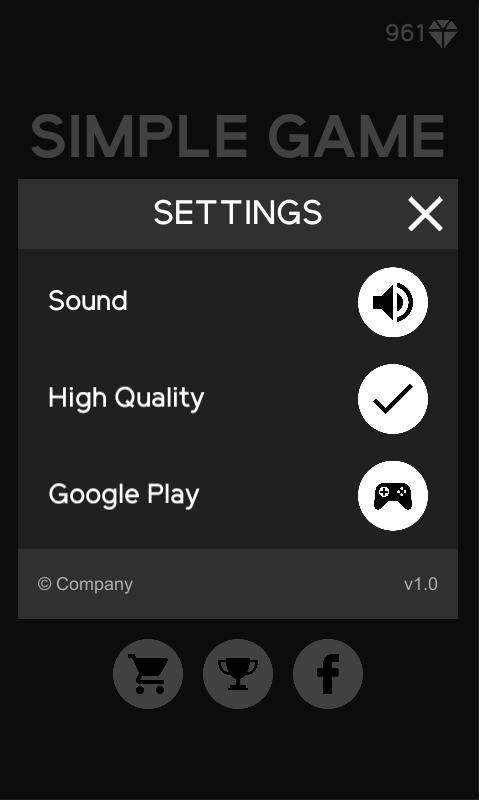
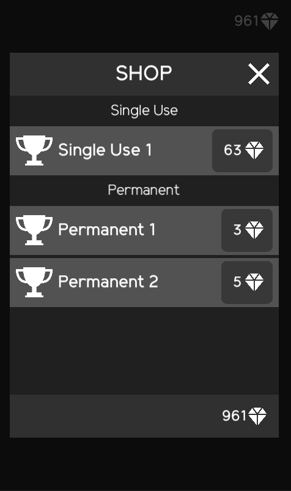

# Simple Game Template

A Unity template for a simple android game.

Features:
  - Google Play services
  - AdTapsy Ad mediation
  - UI with [Data binding](https://github.com/paidgeek/DataBind)
  - Score sharing
  - Premade screens (main, game paused, game over)

Test keystore & key password: `vUuy8t3kFns9PTHpkwchZ7Ac`
